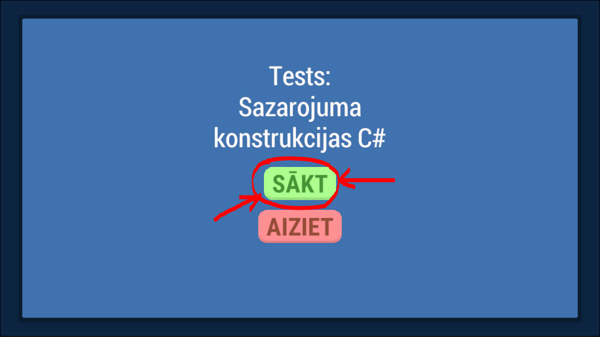
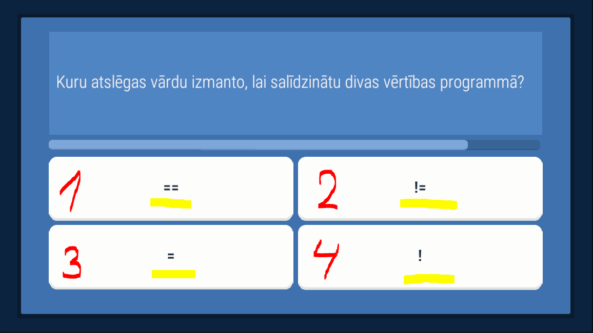

- Mācību materiāls: https://docs.google.com/document/d/113uiGsDJz6yNi3K_HoRqW6kp-kJGVr0g6Gh8YM0YMbI/edit?usp=sharing
- Prezentācija: https://docs.google.com/presentation/d/1YfN2mDxbZJ1HMSACJmpeqMLruGa6QQbrFpusK2SRo0k/edit?usp=sharing

# Testa veidā pārbaudiet savas zināšanas par sazarotajām C# konstrukcijām!

## Eksāmena mērķi

---

- [x] Izstrādāt mācību materiālu un elektronisko testu par tēmu "Sazarojuma konstrukcijas strādājot ar C# programmēšanas valodu Unity dzinī"
- [x] katram jautājumam 4 atbilžu varianti, no kuriem pareizi ir 2 vai 3 atbilžu varianti.
- [x] Lietotājs atbild uz katru jautājumu 1 reizi, nesaņemot tūlītēju atbildes novērtējumu.
- [x] Beigās paziņo, cik jautājumi atbildēti pareizi un izdrukā jautājumu sarakstu, uz kuriem atbildēts nepareizi.

---

- [x] Activity Diagram
- [x] Class Diagram

---

- [x] Mācību materiāls (Sazarojuma Konstrukcijas - Darbs ar C#, Unity)

---

## Neliels ceļvedis

### Sākums
Nospiežam pogu `SĀKT`
(Es zinu, ka ar izejas pogu ir gramatiska kļūda, bet nu.. kas ir tas ir :))

---

### Jautājums
Spēlētājam tiek parādīts pirmais testa jautājums un 4 atbildes uz to, un jums ir jāizvēlas dažas atbildes, kas, jūsuprāt, ir pareizas šim jautājumam.

---

### Atbilžu izvēle
Ja starp piedāvātajām atbildēm redzat pareizo atbildi, noklikšķiniet uz tās, bet, ja vēlaties to atcelt, noklikšķiniet vēlreiz.

---

### Pārdomām atvēlētais laiks
Katram jautājumam ir noteikts laika ierobežojums, 

un, kad tas beidzas, spēlētājs tiek pārcelts uz citu jautājumu.

---

### Rezultāti
1. Visu spēlētājam uzdoto jautājumu saraksts, katra jautājuma beigās ir norādīts, vai spēlētājs atbildēja pareizi vai nē.
2. Atkarībā no tā, cik procentus spēlētājs atbildēja pareizi, tiks parādīts pareizais zvaigznīšu skaits.
3. Mēs varam vēlreiz palaist testu.
4. Vai dodieties uz menu

---

# UML diagrammas

### Activity Diagram

### Class Diagram

## Autors

- [AlexOsta](https://github.com/AlexUnderOS)

